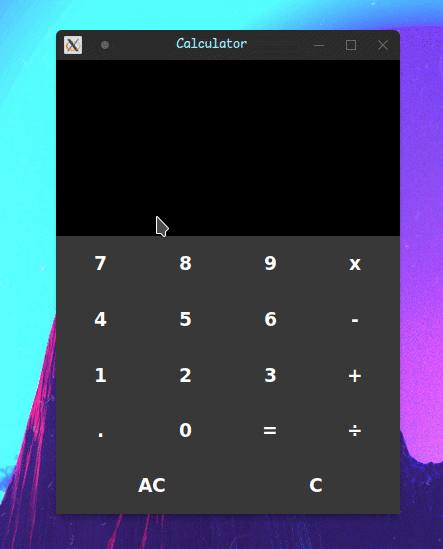

# Simple Calculator

just **simple calculator** that do the basic math operations build with  using .

## Demo:

## TO-DO:
- [ ] Add click effect on calculator buttons.
- [ ] use json file to save the buttons style and label style. 